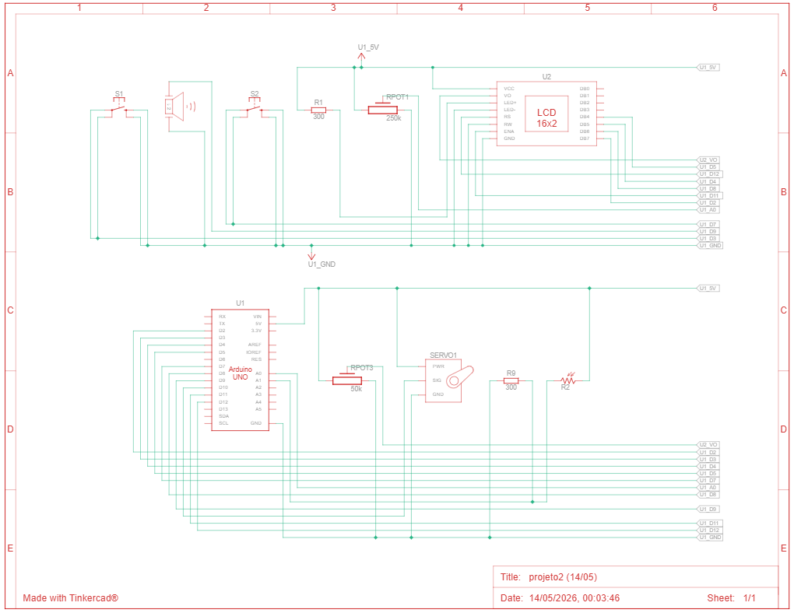
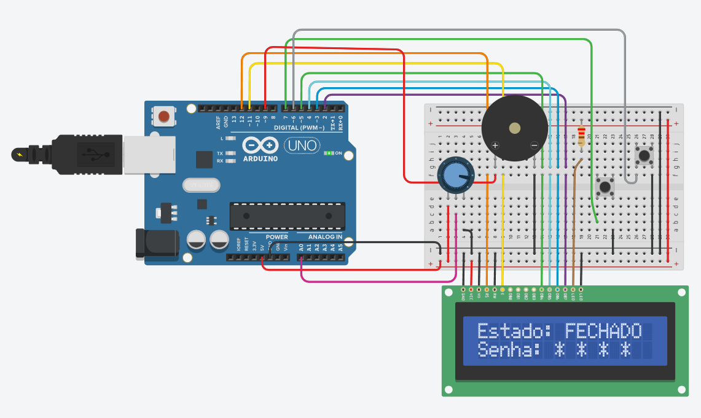

# Locker: Sistema de Controle de Acesso com Arduino

Projeto desenvolvido para a disciplina de **IOT**.

- Danilo Cardoso Pradella - RA: 22.126.096-1
- Caue Ohta - RA: 22.126.093-8

---

## Descrição

Sistema embarcado de controle de acesso para um compartimento seguro (cofre), implementado em **Arduino Uno** e simulado no **Tinkercad**. O sistema gerencia a entrada de uma senha numérica via potenciômetro, valida o acesso e monitora condições de segurança do ambiente por meio de um sensor de luz (LDR).

---

## Hardware

### Componentes

| Componente | Qtd. | Função |
|---|---|---|
| Arduino Uno | 1 | Microcontrolador principal |
| Display LCD 16x2 | 1 | Exibe o estado do sistema e a senha em digitação |
| Servo Motor | 1 | Trava mecânica: 0° = fechado, 90° = aberto |
| Potenciômetro 50kΩ | 2 | Ajuste de contraste do LCD e seleção de dígito da senha |
| Botão de dígito | 1 | Confirma o dígito selecionado |
| Botão de reset | 1 | Interrupção externa: reseta o sistema para FECHADO |
| Buzzer | 1 | Feedback sonoro: sucesso, erro e alarme |
| LDR | 1 | Detecta abertura forçada do cofre |
| Resistor 300Ω | 2 | Limitação de corrente (buzzer e LDR) |
| Protoboard | 1 | Montagem e conexão dos componentes |

### Mapeamento de Pinos

| Pino Arduino | Periférico | Descrição |
|---|---|---|
| D2 | LCD DB7 | Barramento de dados do LCD |
| D4 | LCD DB5 | Barramento de dados do LCD |
| D5 | LCD DB4 | Barramento de dados do LCD |
| D7 | LCD EN | Enable do LCD |
| D8 | LCD DB3 | Barramento de dados do LCD |
| D9 | Buzzer | Saída PWM para geração de tons |
| D10 | Servo (PWM) | Controle de posição do servo motor |
| D11 | LCD RS | Register Select do LCD |
| D12 | LCD D6 | Barramento de dados do LCD |
| D3 | Botão Reset | Interrupção externa INT1 (FALLING) |
| D7 | Botão Dígito | Entrada digital com pull-up interno |
| A0 | Potenciômetro | Leitura analógica para seleção de dígito |
| A1 | LDR | Leitura analógica para detecção de luz |

### Diagrama de Conexão



### Circuito no Tinkercad



---

## Firmware

### Bibliotecas

- `LiquidCrystal.h` - controle do display LCD 16x2
- `Servo.h` - controle de posição do servo motor

### Máquina de Estados (FSM)

O sistema opera com 4 estados:

| Estado | Condição de Entrada | Comportamento |
|---|---|---|
| **TRANCADO** | Inicialização / senha incorreta / reset | Servo em 0°, LCD exibe `FECHADO`, senha zerada |
| **SENHA** | Usuário move o potenciômetro | LCD mostra dígito atual; botão confirma |
| **ABERTO** | Senha de 4 dígitos correta | Servo em 90°, LCD exibe `ABERTO`; só sai via reset |
| **ALERTA** | 3 tentativas erradas ou LDR detecta luz | Buzzer contínuo, LCD exibe mensagem de alarme; só sai via reset |

### Entrada da Senha

A senha possui **4 dígitos**, cada um entre `0` e `4`, selecionados pelo potenciômetro (A0) conforme o mapeamento:

```
v < 150 → '0' | v < 350 → '1' | v < 550 → '2' | v < 750 → '3' | demais → '4'
```

Uma tolerância de 20 pontos ADC filtra oscilações e garante que o usuário moveu o potenciômetro antes de aceitar um dígito.

### Detecção de Arrombamento

O LDR monitora a luminosidade interna do cofre. Se o valor analógico em A1 superar **290** durante os estados TRANCADO ou SENHA, o sistema interpreta como abertura forçada e transita imediatamente para ALERTA, exibindo `COFRE ARROMBADO!`.

### Reset por Interrupção

O botão de reset (D3) usa interrupção de hardware configurada na borda de descida (FALLING). A ISR apenas seta a flag `reset_solicitado = true`, verificada com prioridade máxima no início de cada iteração do `loop()`.

### Feedback Sonoro

| Evento | Padrão |
|---|---|
| Senha correta | Sequência ascendente de 3 notas |
| Senha incorreta | Sequência descendente de 2 notas |
| Tentativas esgotadas | Pulsos alternados em 880 Hz e 660 Hz |
| Arrombamento | Pulsos em 880 Hz com intervalos de 100 ms |

---

## Fluxo de Operação

```
loop()
 ├── 1. Reset solicitado? → processar_reset() e retornar
 ├── 2. LDR acima do valor escolhido e estado TRANCADO/SENHA? → ALERTA (arrombamento)
 └── 3. Processar estado atual:
      ├── TRANCADO / SENHA → ler pot, exibir dígito, processar botão
      ├── ABERTO → aguardar reset
      └── ALERTA → buzzer contínuo até reset
```

---

## Como simular

1. Acesse o [Tinkercad](https://www.tinkercad.com) e crie um novo circuito
2. Monte o hardware conforme o diagrama em `docs/diagrama.png`
3. Cole o código de `locker.ino` no editor do Tinkercad
4. Inicie a simulação

---

## Estrutura do repositório

```
.
├── README.md          # Este arquivo
├── docs/
│   ├── diagrama.png        # Diagrama esquemático do circuito
│   ├── circuito.png        # Visão do circuito na protoboard
│   └── relatorio.pdf       # Relatório técnico do projeto
└── locker/
    └── locker.ino          # Código-fonte do firmware
```
